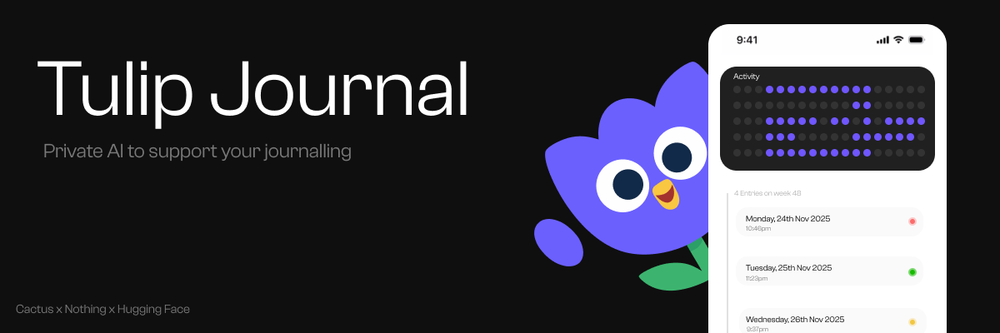

# Tulip

An AI-powered journaling app designed to support memory and reduce cognitive load. Tulip helps you reflect on your day through structured nightly journal entries, then uses on-device AI to analyze patterns and provide insights based on sleep science principles.

## Features

- **90-Day Activity Tracker** - Visual overview of your journaling consistency
- **Structured Journal Entries** - Six-field reflection framework covering what matters most
- **AI-Powered Insights** - On-device analysis using Cactus LLM with complete privacy
- **Cross-Platform** - Runs on iOS, Android, and web
- **Offline-First** - All data stored locally with SQLite

## Quick Start

```bash
# Install dependencies
npm install

# Start development server
npx expo start

# Run on specific platforms
npx expo run:ios      # iOS simulator/device
npx expo run:android  # Android emulator/device
npm run web           # Web browser
```

## Journal Entry Structure

Each daily entry includes six reflection prompts:

1. **Remember** - What I want to remember tomorrow
2. **Moments** - Meaningful moments from today
3. **Understanding** - What I'm trying to understand or solve
4. **Wins** - What went well today (small wins)
5. **Drop** - What wasn't important and can be dropped
6. **Intentions** - Intentions for tomorrow

## AI Insights

Tulip analyzes your last 5 days of entries to generate insights across five dimensions:

- **Themes** - Recurring themes you've marked as important
- **Moments** - Meaningful moments and emotional patterns
- **Problems** - Core problems and unsolved threads
- **Progress** - Progress, competence, and growth
- **Deprioritized** - Things you've let go of

All AI processing happens on-device using the Cactus LLM library with your journal entries as context.

## Technology Stack

- **Framework**: Expo + React Native (New Architecture)
- **UI**: React 19 with React Compiler
- **Routing**: Expo Router v6 (file-based)
- **Database**: SQLite (expo-sqlite)
- **AI**: Cactus LLM (on-device inference)
- **Storage**: AsyncStorage + FileSystem

## Project Structure

```
app/
├── (tabs)/
│   ├── index.tsx           # Home screen (activity grid + week view)
│   └── explore.tsx         # Placeholder tab
├── journal-entry.tsx       # Journal entry modal
├── insight-*.tsx           # AI insight modals
└── _layout.tsx             # Root layout

components/
├── home/                   # Home screen components
├── journal/                # Journal form components
└── ui/                     # Shared UI components

lib/
├── ai/                     # AI integration layer
├── database/               # SQLite schema and operations
├── models/                 # Data models and CRUD
├── storage/                # AsyncStorage and corpus management
└── utils/                  # Helpers and utilities
```

## Development

```bash
# Lint code
npm run lint

# Reset to blank slate
npm run reset-project
```

## Documentation

For detailed development guidance, see [CLAUDE.md](./CLAUDE.md).

## License

Private project - All rights reserved.
